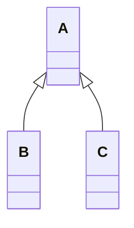
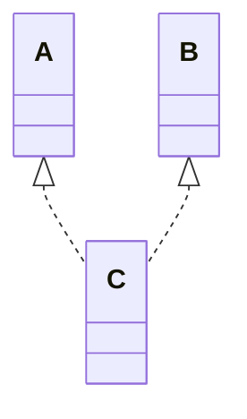
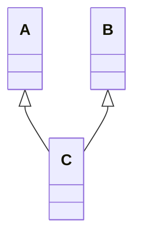
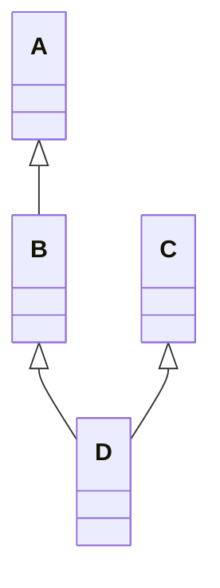

# 🚀 Inheritance in Java vs C++

## 🔷 Inheritance in Java

Java supports **4 main types of inheritance**:

---

### 1. Single Inheritance

One class inherits from one parent.

```java
class A {}
class B extends A {}
```

```

```


---

### 2. Multilevel Inheritance

Inheritance chain (grandparent → parent → child).

```java
class A {}
class B extends A {}
class C extends B {}
```


---

### 3. Hierarchical Inheritance

Multiple classes inherit from the same parent.

```java
class A {}
class B extends A {}
class C extends A {}
```



---

### 4. Hybrid Inheritance (via Interfaces)

Combination of multiple types using **interfaces**.

```java
interface A {}
interface B {}
class C implements A, B {}
```



⚠️ Java does **not** support multiple inheritance with classes (only with interfaces).

---

## 🔷 Inheritance in C++

C++ is more flexible and supports **5 main types of inheritance**:

---

### 1. Single Inheritance

```cpp
class A {};
class B : public A {};
```


---

### 2. Multilevel Inheritance

```cpp
class A {};
class B : public A {};
class C : public B {};
```


---

### 3. Multiple Inheritance

One class inherits from more than one base class.

```cpp
class A {};
class B {};
class C : public A, public B {};
```



---

### 4. Hierarchical Inheritance

```cpp
class A {};
class B : public A {};
class C : public A {};
```


---

### 5. Hybrid Inheritance

Combination of multiple types (e.g., multiple + multilevel).

```cpp
class A {};
class B : public A {};
class C {};
class D : public B, public C {};  // hybrid
```



---

## ⚡ Key Differences Between Java and C++

| Feature                            | Java                       | C++                                 |
| ---------------------------------- | -------------------------- | ----------------------------------- |
| **Single Inheritance**             | ✅ Supported               | ✅ Supported                        |
| **Multilevel Inheritance**         | ✅ Supported               | ✅ Supported                        |
| **Multiple Inheritance (classes)** | ❌ Not allowed             | ✅ Allowed                          |
| **Hierarchical Inheritance**       | ✅ Supported               | ✅ Supported                        |
| **Hybrid Inheritance**             | ✅ Only via **interfaces** | ✅ Supported (classes + interfaces) |
| **Default Access**                 | _package-private_          | `private`                           |

---

## 📌 Summary

- **Java** → single, multilevel, hierarchical, hybrid (via interfaces). No multiple inheritance with classes.
- **C++** → supports all types including **multiple inheritance** with classes.

```

```
